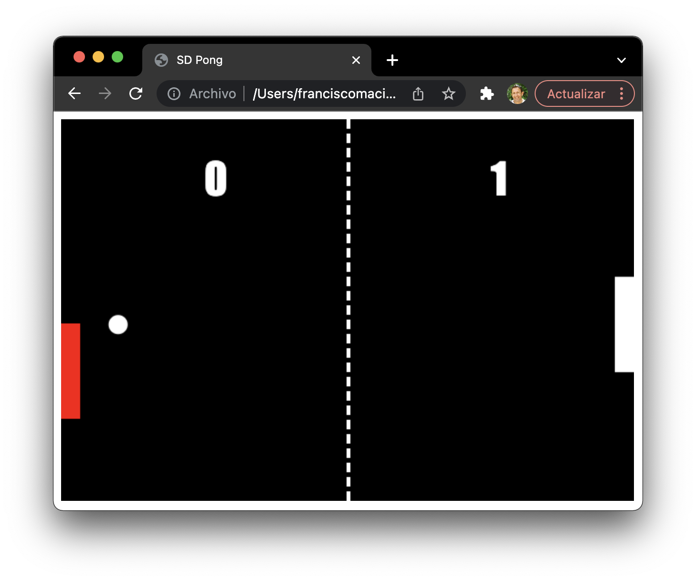

# Juego PONG Multijugador en Red 🏓

Implementación en _**JavaScript + Node.js**_ del clásico videojuego **PONG** en su versión **multijugador en red**, desarrollada como práctica de la asignatura _**Sistemas Distribuidos**_ del Grado en Ingeniería Multimedia de la _Universidad de Alicante_.

El proyecto ilustra el uso de _**WebSockets**_ (mediante la biblioteca **Socket.IO**) para implementar **comunicaciones bidireccionales en tiempo real** entre un _Servidor de Juego_ centralizado y varios _clientes web_.

<p align="center"></p>

## Tabla de contenidos

- [Arquitectura](#arquitectura-)
- [Comenzando](#comenzando-)
  - [Pre-requisitos](#pre-requisitos-)
  - [Instalación de la fuente Impact](#instalación-de-la-fuente-impact-)
  - [Instalación del proyecto](#instalación-del-proyecto-)
- [Ejecución](#ejecución-)
- [Cómo jugar](#cómo-jugar-)
- [Estructura del proyecto](#estructura-del-proyecto-)
- [Despliegue](#despliegue-)
- [Construido con](#construido-con-)
- [Versionado](#versionado-)
- [Autores](#autores-)
- [Licencia](#licencia-)

## Arquitectura 🏗️

El sistema sigue una **arquitectura cliente/servidor autoritativa**:

- El **_Backend_** consiste en un proceso **Node.js** que reúne dos componentes:
  - Un **Servidor Web** (basado en **Express**) que sirve los recursos estáticos del juego (HTML + JS) desde la carpeta `/public`.
  - Un **Servidor WebSocket** (basado en **Socket.IO**) que implementa el **_Motor de Red_** (_Network Engine_), encargado de mantener el estado oficial de la partida, recibir los movimientos de los jugadores y difundir el estado del juego a todos los clientes.

- El **_Frontend_** es una sencilla _página web_ creada con **HTML5**, **Canvas** y **JavaScript**, que actúa como **GUI (Interfaz Gráfica de Usuario)**. Captura las entradas del jugador (movimiento del ratón), las envía al servidor por WebSocket y dibuja el estado del juego recibido del mismo.

El estado del juego (palas, pelota, marcador, máquina de estados) reside **íntegramente en el servidor**: los clientes son meros terminales de visualización y captura de entradas. Para una explicación detallada de la arquitectura, los casos de uso y los diagramas de secuencia, consultar la _Memoria 4_ del proyecto.

## Comenzando 🚀

Estas instrucciones permiten obtener una copia del proyecto en marcha en una máquina local con fines de desarrollo y pruebas.

> 📝 **Nota:** ver la sección [Despliegue](#despliegue-) para conocer cómo desplegar el proyecto en un entorno de producción.

### Pre-requisitos 📋

Es necesario tener instalado **Node.js** (versión LTS recomendada) en el equipo. Las siguientes órdenes muestran cómo instalarlo en **Ubuntu 22.04**:

```sh
$ sudo apt update
$ sudo apt install nodejs npm
$ sudo npm i -g n
$ sudo n stable
```

Una vez instalado, comprueba que la versión sea correcta:

```sh
$ node --version
$ npm --version
```

### Instalación de la fuente Impact 🔤

El marcador del juego utiliza la fuente **Impact**. Para una visualización correcta en sistemas Linux donde esta fuente no esté disponible por defecto, se puede instalar de forma global siguiendo estos pasos:

1. **Descargar** la fuente desde un sitio de confianza, por ejemplo:
   > https://www.dafontfree.io/download/impact/

2. **Mover** el archivo descargado a la carpeta de _Descargas_:

```sh
$ cd ~/Descargas/
```

3. **Descomprimir** el archivo ZIP:

```sh
$ unzip Impact-Font.zip
```

4. **Copiar** el archivo `.ttf` a la carpeta de fuentes del sistema:

```sh
$ sudo cp ./impact.ttf /usr/local/share/fonts/
```

5. **Refrescar** la caché de fuentes:

```sh
$ sudo fc-cache -f -v
```

> ℹ️ En **Windows** y **macOS** la fuente Impact viene instalada por defecto, por lo que no es necesario hacer nada.

### Instalación del proyecto 🔧

1. **Clonar** el repositorio:

```sh
$ git clone https://bitbucket.org/<usuario>/pong.git
```

2. **Entrar** en la carpeta del proyecto:

```sh
$ cd pong
```

3. **Instalar** las dependencias declaradas en `package.json`:

```sh
$ npm install
```

## Ejecución ▶️

Una vez instalado el proyecto, para arrancar el Servidor de Juego basta con ejecutar:

```sh
$ npm start
```

Internamente, esto lanza `nodemon game-server.js`, por lo que el servidor se reiniciará automáticamente al detectar cambios en los archivos fuente durante el desarrollo.

Por defecto, el servidor se pone a la escucha en el **puerto 3000**. Si se desea utilizar otro puerto, se puede definir mediante la variable de entorno `PORT`:

```sh
$ PORT=8080 npm start
```

Una vez en marcha, los jugadores deben abrir desde sus navegadores la URL del servidor:

```
http://<ip-del-servidor>:3000/
```

## Cómo jugar 🎮

1. Asegúrate de que el **Servidor de Juego** esté en marcha (paso anterior).
2. Cada jugador abre, desde su propio navegador, la URL del servidor.
3. El **primer jugador** en conectarse será el _**Jugador A**_ (pala roja a la izquierda).
4. El **segundo jugador** en conectarse será el _**Jugador B**_ (pala blanca a la derecha). En ese momento se crea la pelota y comienza la partida.
5. Cada jugador controla su pala **moviendo el ratón** sobre la zona del canvas.
6. Gana el primer jugador que alcance **5 tantos**.

> ⚠️ **Aviso:** el juego está limitado a 2 jugadores simultáneos. Cualquier tercer cliente que intente conectarse será desconectado automáticamente.

## Estructura del proyecto 📁

```
pong/
├── public/
│   ├── index.html              # Página principal con el <canvas>
│   ├── graphics-engine.js      # Motor Gráfico (primitivas de dibujo)
│   └── pong.js                 # GUI: motor de control, bucle de render y cliente WebSocket
├── game-server.js              # Servidor de Juego: Servidor Web + WebSocket + Motor de Red
├── package.json                # Dependencias y scripts del proyecto
├── package-lock.json           # Bloqueo de versiones de dependencias
├── pong.png                    # Captura de pantalla del juego
└── README.md                   # Este archivo
```

## Despliegue 📦

En el entorno de **desarrollo**, el mismo proceso Node.js actúa simultáneamente como _Servidor Web_ (sirviendo el contenido de `/public`) y como _Servidor WebSocket_ (gestionando el Motor de Red).

> ⚠️ **Atención:** para desplegar en producción, deberá configurarse en `pong.js` la constante `WEBSOCKET_SERVER` con la dirección pública del Servidor de Juego.

Para un despliegue de **producción** más robusto, se recomienda:

1. **Servir los recursos estáticos** mediante un servidor web especializado como **Apache2** o **NginX**: copiar el contenido de `/public` a la carpeta correspondiente (`/var/www/html/` en Apache, por ejemplo).
2. **Lanzar el Servidor de Juego Node.js** en una máquina (o contenedor) con las **CORS** correctamente configuradas para aceptar conexiones WebSocket desde el dominio donde se sirve el frontend.
3. **Abrir el puerto 3000** (o el que se configure) en el firewall del servidor:

```sh
$ sudo ufw allow 3000/tcp
```

4. _(Opcional)_ Utilizar un gestor de procesos como **PM2** o **systemd** para mantener el servidor en marcha y reiniciarlo automáticamente en caso de fallo.

## Construido con 🛠️

Las principales herramientas y bibliotecas utilizadas en el proyecto son:

- [Node.js](https://nodejs.org/) — Entorno de ejecución JavaScript del lado del servidor.
- [Express](https://expressjs.com/es/) — Infraestructura web minimalista para Node.js que facilita la creación de servidores HTTP.
- [Socket.IO](https://socket.io/docs/v4/) — Biblioteca que proporciona comunicaciones bidireccionales, de baja latencia y basadas en eventos sobre WebSocket.
- [nodemon](https://www.npmjs.com/package/nodemon) — Herramienta de desarrollo que reinicia automáticamente el servidor Node.js al detectar cambios en los archivos.
- [HTML5 Canvas API](https://developer.mozilla.org/es/docs/Web/API/Canvas_API) — API del navegador para dibujar gráficos 2D programáticamente.

## Versionado 📌

Se utiliza [SemVer](http://semver.org/) para el versionado. Las versiones disponibles se encuentran en los [tags del repositorio](https://bitbucket.org/<usuario>/pong/tags).

A lo largo del desarrollo se han etiquetado las siguientes versiones, correspondientes a las tres fases incrementales del proyecto:

| Tag    | Descripción                                                  |
| ------ | ------------------------------------------------------------ |
| v1.0.0 | Juego Pong monojugador básico (sin servidor web).            |
| v2.0.0 | Juego Pong monojugador servido desde un servidor web.        |
| v3.0.0 | Juego Pong multijugador en red _**(versión actual)**_.       |

## Autores ✒️

- **Enzo Adolfo Rubattino Huarzaya** [earh1@alu.ua.es](mailto:earh1@alu.ua.es)
- **Paco Maciá** — _Trabajo inicial y guía del proyecto_ — [pmacia](https://bitbucket.org/pmacia)

## Licencia 📄

Este proyecto se distribuye bajo licencia **ISC**. Consulta el archivo `LICENSE` (si existe) o el campo `license` de `package.json` para más detalles.

---

_Proyecto académico desarrollado para la asignatura **Sistemas Distribuidos** del Grado en Ingeniería Multimedia de la **Universidad de Alicante**, curso 2025-2026._
